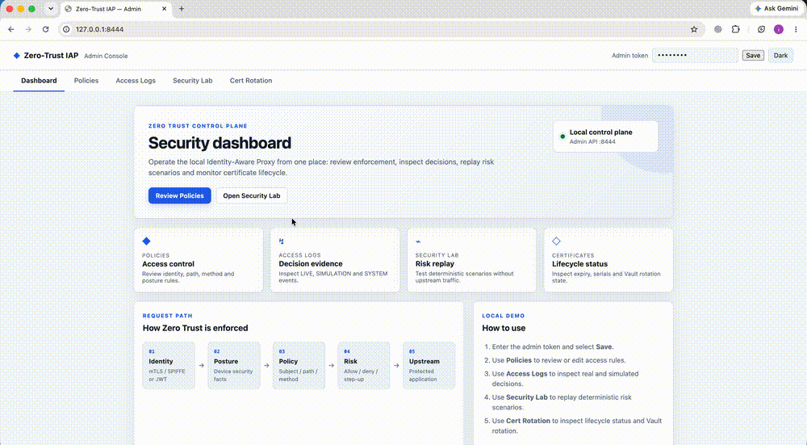
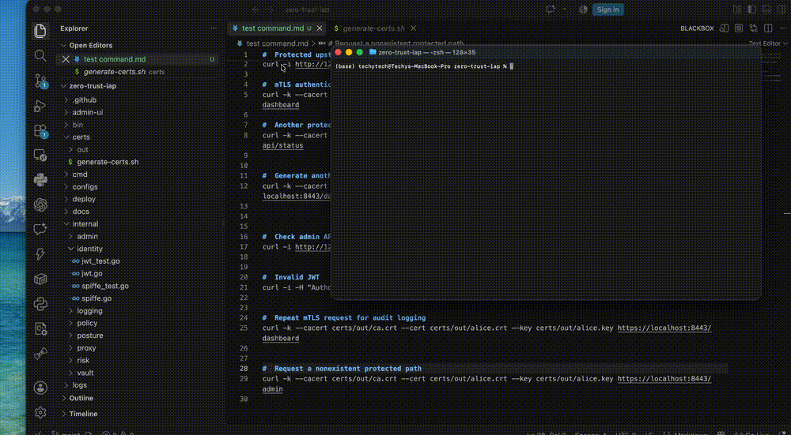
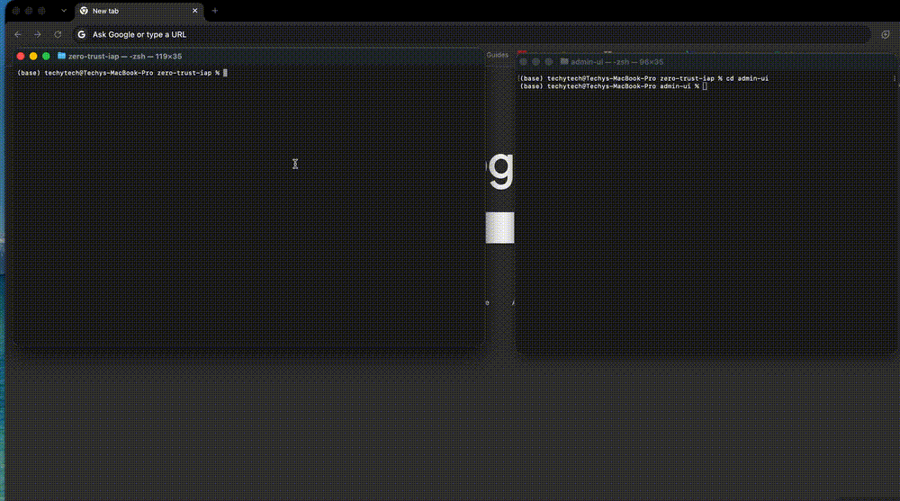

# Zero-Trust Identity-Aware Proxy (IAP)

**A security-focused Identity-Aware Proxy built from scratch in Go that enforces Zero Trust access at the application layer — authenticating identity, validating device posture, evaluating policy, and authorizing every request before it reaches an internal service.**

This project explores what happens when you remove the assumption that **network location equals trust**.

Instead of treating a user as trusted simply because they are connected to a VPN or inside a corporate network, the proxy evaluates:

- **Who** is making the request
- **What cryptographic identity** they present
- **What device** they are using
- **Whether the device satisfies security posture requirements**
- **What resource and HTTP method** they are requesting
- **Which policy** permits or denies the request
- **Whether credentials and certificates are still valid**
- **Whether adaptive risk changes the final decision**

## Zero Trust Request Flow Demo

The request flow below shows the local Zero Trust enforcement path from identity verification through policy and risk evaluation to the final allow/deny decision.



## Architecture

```text
                         ZERO-TRUST REQUEST FLOW

 [User / Workload]
        │
        │  mTLS / JWT
        ▼
 ┌──────────────────────────────┐
 │     Go Identity-Aware Proxy  │
 │                              │
 │  1. Authenticate identity    │
 │  2. Validate credentials     │
 │  3. Check device posture     │
 │  4. Evaluate security policy │
 │  5. Evaluate adaptive risk   │
 │  6. Authorize request        │
 └──────────────┬───────────────┘
                │
        ┌───────┴────────┐
        │                │
        ▼                ▼
 [SPIFFE/SPIRE]     [Posture Agent]
  Workload ID       Device Security
        │                │
        └───────┬────────┘
                │
                ▼
        [HashiCorp Vault]
        Secrets / PKI / Certs
                │
                ▼
        ┌─────────────────┐
        │ Policy + Risk   │
        │ Decision Engine │
        │                 │
        │ ALLOW / DENY    │
        │ STEP-UP /       │
        │ QUARANTINE      │
        └────────┬────────┘
                 │
        ┌────────┴─────────┐
        │                  │
      ALLOW               DENY
        │                  │
        ▼                  ▼
 [Protected App]      [Access Blocked]
        │
        └──────────┬───────────────┐
                   │               │
                   ▼               ▼
             [Audit Logs]   [Admin Console]
                              :8444
```

## Admin Console

The project includes a local security operations console under `admin-ui/`. The console is deliberately organized as a control plane rather than putting every feature on one page.

### Dashboard

The **Dashboard** is the default home tab. It provides a visual overview of the local control plane, including:

- Local admin control-plane status
- Quick links to Policies, Access Logs, Security Lab and Certificate Rotation
- A visual request-enforcement flow from identity to the protected application
- Local demo endpoints
- A concise **How to use** guide

The default theme is **light**. The top-right theme control switches between light and dark mode and persists the selection in browser local storage.

### Policies

The **Policies** tab lets an administrator:

- List active policies
- Create a policy
- Edit an existing policy
- Enable or disable a policy
- Delete a policy
- Configure subjects, path prefixes and HTTP methods
- Configure required device posture such as disk encryption, EDR and minimum patch level

The policy engine remains the enforcement authority; the UI only manages policy configuration through the authenticated admin API.

### Access Logs

The **Access Logs** tab exposes structured events from the proxy control plane:

- `LIVE` — real requests processed by the IAP
- `SIMULATION` — Security Lab decision replays
- `SYSTEM` — control-plane events such as certificate rotation

Logs include the subject, request, authentication method, policy ID, risk score/action, reason and status code. Live entries can be loaded into the Security Lab for replay.

### Security Lab

The **Security Lab** is a deterministic decision-replay environment. It can simulate combinations of:

- Authentication state
- Device posture
- Certificate validity
- Policy result
- Authentication method
- Sensitive-resource access
- Recent denials

The simulation does **not** send traffic to the upstream application. Its result is displayed with the risk score and decision evidence and is saved to Access Logs as a `SIMULATION` event.

This makes it possible to demonstrate risk decisions and attack scenarios without changing the live application traffic path.

### Certificate Rotation

The **Cert Rotation** tab displays:

- Rotation source
- Last rotation time
- Certificate expiry
- Serial number
- Last rotation error, when present

Static-file demo certificates expose their real expiry and serial information but intentionally cannot be rotated live. When Vault PKI is configured, the **Rotate Now** control can trigger an immediate rotation, while the proxy also supports automatic rotation before expiry.

## Why this exists

Traditional network-based access models often establish trust from where a request originates: authenticate to a VPN, receive an internal network identity, and rely on downstream services to trust that network boundary.

This project moves the trust decision to the application access layer and addresses two core problems:

1. **Network location is not identity.** A compromised device connected to an internal network can otherwise look similar to a legitimate device. This proxy requires cryptographic workload identity instead of relying on IP-based trust.
2. **Authentication is not the same as authorization.** A valid login does not automatically mean a device should access sensitive resources. The proxy evaluates device posture, policy and adaptive risk before forwarding a request, using fail-closed behavior when required security information is unavailable or stale.

The result is a small, auditable reference implementation demonstrating identity-aware access control, certificate-based authentication, device posture, policy enforcement, adaptive risk evaluation, secrets management, certificate rotation, security audit logging and a local security operations console.

See [`docs/vpn-comparison.md`](docs/vpn-comparison.md) for a detailed before/after comparison.

## What's implemented

| Component | Where | Notes |
|---|---|---|
| Go reverse proxy, mTLS termination | `internal/proxy/`, `cmd/proxy/` | stdlib `net/http` + `crypto/tls` only |
| SPIFFE-style identity verification | `internal/identity/spiffe.go` | parses/validates `spiffe://` URI SANs, trust domain + SVID freshness checks |
| JWT fallback auth | `internal/identity/jwt.go` | hand-rolled HS256/RS256 verification with algorithm restrictions |
| Policy engine | `internal/policy/` | subject/path/method/posture rules, deny-by-default, hot-reloadable via admin API |
| Adaptive risk engine | `internal/risk/` | evaluates posture, policy, certificate, sensitivity and recent-denial context |
| Vault integration | `internal/vault/`, `internal/proxy/rotation.go` | KV secrets + PKI issuance, automatic rotation and hot-swap |
| Device posture agent | `cmd/posture-agent/`, `internal/posture/` | disk-encryption, EDR-presence and patch-level checks; Linux/macOS/Windows via build tags |
| Admin REST API | `internal/admin/` | authenticated policy, log, replay and certificate-control endpoints |
| Admin Console | `admin-ui/` | TypeScript UI with Dashboard, Policies, Access Logs, Security Lab and Cert Rotation tabs |
| Protected demo app | `cmd/demo-app/` | small upstream dashboard served on `127.0.0.1:8081` for end-to-end local testing |
| Access logging | `internal/logging/` | structured JSON, append-only file + queryable in-memory ring buffer |

## Local demo

The repository includes a protected placeholder application so the complete request path can be demonstrated without deploying a separate backend.

```text
Browser / curl
      │
      ▼
 https://localhost:8443/dashboard
      │
      ▼
 Zero-Trust IAP
      │
      ├── mTLS / SPIFFE identity
      ├── Device posture
      ├── Policy evaluation
      └── Adaptive risk
      │
      ▼
 http://127.0.0.1:8081/dashboard
      │
      ▼
 Protected Demo Dashboard
```

The demo application intentionally **does not make authorization decisions**. The IAP remains the security boundary.

## Quick start

Requires Go 1.22+, OpenSSL and Node.js.

```bash
git clone <this-repo>
cd zero-trust-iap
make dev-up
```

The local startup script builds the Go binaries and Admin UI, generates demo certificates when needed, starts the posture agent, starts the protected demo application on `127.0.0.1:8081`, and starts the IAP/admin control plane.

Default local values:

```text
IAP admin token: devtoken
Admin Console:   http://127.0.0.1:8444/
Protected IAP:   https://localhost:8443/dashboard
Demo upstream:   http://127.0.0.1:8081/dashboard
Posture agent:   http://127.0.0.1:9443
```

The admin token is for the local demo only. Set `IAP_ADMIN_TOKEN` to another value when needed.

### Test the upstream directly

This bypasses the IAP and verifies that the placeholder application itself is running:

```bash
curl -i http://127.0.0.1:8081/dashboard
```

Expected result: `HTTP/1.1 200 OK`.

### Test through the IAP

Use the generated Alice client certificate:

```bash
curl -k \
  --cacert certs/out/ca.crt \
  --cert certs/out/alice.crt \
  --key certs/out/alice.key \
  https://localhost:8443/dashboard
```

The result depends on the active posture and policy configuration. A `403 access denied` is an expected and useful outcome when the device fails a required posture check or the policy/risk engine denies the request.

### Open the Admin Console

```bash
open http://127.0.0.1:8444/
```

Enter the admin token (`devtoken` by default) and select **Save**. The Dashboard is the default tab, with navigation to every other control-plane feature.

## Demo workflow

A useful end-to-end demonstration is:

1. Start the stack with `make dev-up`.
2. Open the Admin Console at `http://127.0.0.1:8444/`.
3. Start on **Dashboard** to see the request flow and local endpoints.
4. Open **Policies** and inspect the engineering, contractor and JWT example policies.
5. Send a request to `https://localhost:8443/dashboard` with a client certificate.
6. Open **Access Logs** and inspect the resulting `LIVE` decision, policy ID, risk action and reason.
7. Open **Security Lab** and replay an allow/deny scenario without sending upstream traffic.
8. Return to **Access Logs** and observe the resulting `SIMULATION` event.
9. Open **Cert Rotation** to inspect the active certificate lifecycle.
10. Switch the Dashboard between light and dark mode if you want to demonstrate the UI preference persistence.

## Demo

The repository includes a visual walkthrough of the local Zero Trust enforcement flow. The GIFs below are embedded directly so they render as animated previews on the GitHub README.

### Zero Trust Request Flow


### Adaptive Risk and Quarantine



### Security Lab Policy Replay



### Screenshots

- [Admin Dashboard](docs/demo/screenshots/01-admin-dashboard.png)
- [Live mTLS Deny](docs/demo/screenshots/02-live-mtls-deny.png)
- [Adaptive Risk / Quarantine](docs/demo/screenshots/03-adaptive-risk-quarantine.png)
- [Security Lab Allow](docs/demo/screenshots/04-security-lab-allow.png)
- [Access Logs](docs/demo/screenshots/05-access-logs.png)
- [Certificate Rotation](docs/demo/screenshots/06-certificate-rotation.png)
- [Protected Dashboard](docs/demo/screenshots/07-protected-dashboard.png)

These assets provide a visual walkthrough of identity verification, mTLS enforcement, adaptive risk decisions, policy replay, access logging, certificate lifecycle information and the protected upstream application.

## Security model

Every protected request is evaluated at the application boundary. The proxy authenticates the presented identity, validates certificate/JWT properties, obtains device posture when configured, evaluates the policy engine, evaluates adaptive risk and only forwards requests that satisfy the configured controls.

Important local-demo behavior:

- Demo certificates are generated locally with OpenSSL instead of requiring a live SPIRE server.
- The posture agent is a local demo component; production deployments need authenticated posture reporting.
- Static demo certificates cannot be live-rotated; Vault PKI enables live rotation.
- The Admin Console is a local control plane and should not be exposed directly to an untrusted network.

## Why zero external Go dependencies

Every package — SPIFFE parsing, JWT verification, the Vault client — is built on the Go standard library alone (`crypto/x509`, `crypto/tls`, `net/http`, `crypto/hmac`/`crypto/rsa`). This was a deliberate constraint, not an accident:

- It demonstrates the security primitives instead of hiding them behind large SDKs.
- The whole Go module builds offline, with no Go dependency supply-chain surface.
- The project cross-compiles cleanly for Linux, macOS and Windows, which matters for a posture agent shipping to heterogeneous fleets.

## Repository layout

```text
cmd/
  proxy/            data-plane + admin-plane listeners
  demo-app/         protected local dashboard placeholder
  posture-agent/    local device posture service
  mint-jwt/         development JWT utility
internal/
  identity/         SPIFFE SVID + JWT verification
  policy/           access-control decision engine
  risk/             adaptive risk decision engine
  vault/            minimal Vault REST client (KV + PKI)
  posture/          posture report types + OS-specific checks
  proxy/            reverse proxy, TLS and certificate rotation
  logging/          structured access logging
  admin/            authenticated admin REST API
admin-ui/            TypeScript security operations console
certs/               OpenSSL-based local certificate generation
configs/             example proxy and policy configuration
deploy/              Docker Compose reference deployment
scripts/dev-up.sh    one-command local demo startup
docs/                architecture, VPN comparison and demo assets
```

## Testing

```bash
go test ./...
go vet ./...
gofmt -l .                 # should print nothing
make build
```

For the Admin UI:

```bash
cd admin-ui
npm install
npm run build
```

The CI workflow runs the Go build/test/vet/format checks and the Admin UI build.

## Milestones

| Area | Status |
|---|---|
| Go reverse proxy + mTLS | done |
| SPIFFE-shaped SVID verification | done |
| JWT fallback authentication | done |
| Policy engine + deny-by-default | done |
| Device posture checks | done |
| Adaptive risk evaluation | done |
| Vault PKI + certificate rotation | done |
| Structured access logging | done |
| Admin REST API | done |
| Admin Console Dashboard | done |
| Policies management UI | done |
| Access Logs + replay | done |
| Security Lab | done |
| Certificate lifecycle UI | done |
| Protected local demo application | done |
| Live SPIRE reference deployment | documented in `deploy/` |

## What I'd harden next

Being explicit about the gap between a  implementation and a production deployment is part of the project's security model:

- **Posture agent trust:** the local demo posture endpoint uses plain local HTTP. Production needs signed posture reports bound to a device identity.
- **SPIRE node attestation:** the reference deployment uses demo-friendly join-token attestation. Real fleets should use an appropriate hardware/cloud/Kubernetes attestation mechanism.
- **Vault:** the reference deployment is intentionally simple. Production needs HA storage, auto-unseal and operational hardening.
- **Certificate revocation:** the Vault client has revocation support; integrating revocation with posture degradation is a natural next step.
- **Admin Console exposure:** production deployments should put the control plane behind strong authentication, network controls and audit monitoring rather than exposing it as an unauthenticated local development service.

## License

See the repository for the project's license and contribution files.
